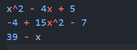
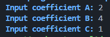
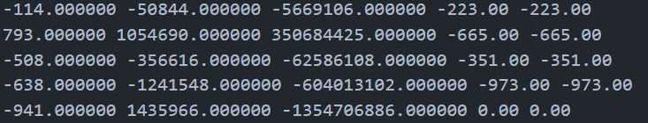
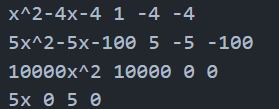

# Solver of quadratic equations

## Table of contest
1. [About progect](#about-project)
2. [Install and compilar](#install-and-compliar)
3. [Start programm and input data](#start-and-input)
4. [Unit tests](#unit-tests)

## About project
This program solving quadratic and linear(special case) equation

In the future, I want to add support for solving equation with power of x == 4

Programm support some arguments of terminal(full list you can see below)

## Install and compilar
You can download  this programm from 
```
https://github.com/Kabuto-Mainer/quadratic-equation-from-SKN
```
For compilar this programm you need 
1. `gcc` or another compilar C++
2. `make` for build program
3. `doxygen` for create documentation

When you download all that you need input on terminal this for make build of program
```
make build
```

## Start program amd input data
If you want to use arguments of terminal you must start program with
```
.\Quad.exe ....
```
Else you can input
```
make run
```

Program suppurt these terminal argumets
1. `wtests` - use to start program without tests
2. `godmod` - use to start program with alternative input mod
3. `meow` - poltorashka
4. `tests` - use to start program only with tests

Program has two type of input
1. String input
2. Separate input

This is some exaple of every input



**first input** 


**second_input**

In first input if you type uncorrect input program will throw an error and open re-input

## Unit Tests 
In this program there are some test function what test solving and parsing function

Data for these tests is in text.txt and test_str.txt

In test.txt there is data for testing solve_quadratic


First three numbers are the coefficients, next two numbers are the correct roots

 
First object is string, next three numbers are correct coefficients

**That's the End**


